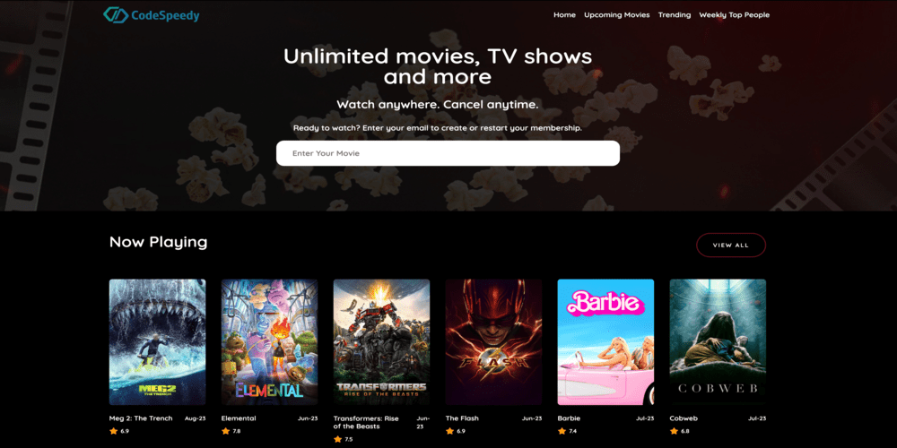
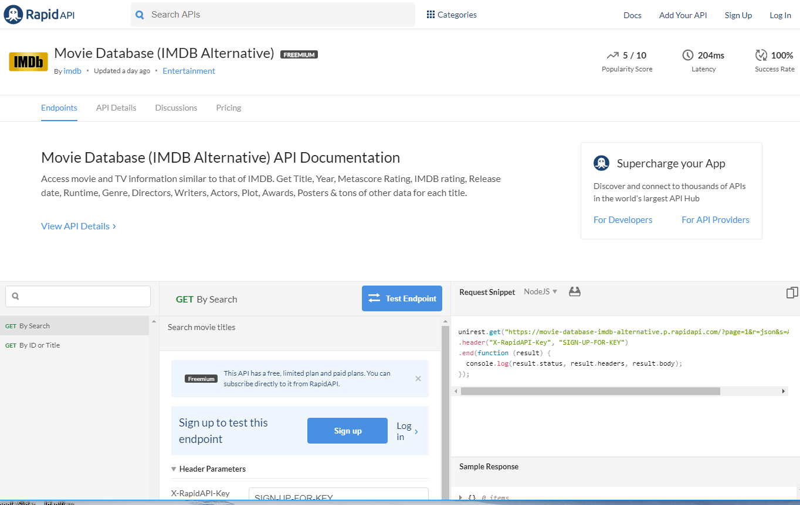

Python FastAPI Movie Listing API with Docker
A Fully Functional Example Project for Managing Movies
Project Overview
This project is a capstone for the AltSchool of Backend Engineering (Python) Tinyuka 2023. The objective is to develop a robust movie listing API using FastAPI, enabling users to list, view, rate, and comment on movies. The application is secured with JWT (JSON Web Tokens), ensuring that only the user who listed a movie can edit it. The API is deployed on a cloud platform, making it accessible and scalable.

Features
User Authentication:

User Registration
User Login
JWT Token Generation for secure endpoints
Movie Management:

View Public Movies
Add Movies (Authenticated Users)
Edit and Delete Movies (Only by the User Who Listed Them)
Movie Rating:

Rate Movies (Authenticated Users)
Retrieve Movie Ratings (Public Access)
Comments:

Add Comments to Movies (Authenticated Users)
View Comments (Public Access)
Nested Comments (Reply to Comments)
Technology Stack
Language & Framework: Python, FastAPI
Authentication: JWT
Database: PostgreSQL
Testing: Pytest
Logging: Integrated Logging for Important Events
Deployment: Dockerized and Deployed on Render
Deeper Dive
This project demonstrates the creation of a RESTful API using FastAPI, showcasing best practices in Python backend development. It includes user authentication, data persistence with PostgreSQL, and deployment using Docker. The entire setup is pushed to Render through a GitHub Actions CI/CD pipeline.

Keywords: FastAPI, REST API, Movie Listing API, Dockerized FastAPI, Python Movie API, JWT Authentication
Architecture Overview
Diagram:

9039439984

User Instructions
To interact with the API:

Explore the Deployed API:
Visit the deployed API here (Replace with your Render link).
API Documentation:
Access Swagger documentation directly at /docs (e.g., https://your-app-url/docs).
Authentication Flow:
Register a new user
Log in to receive a JWT token
Use the token to access protected routes (e.g., add or rate movies)
Developer Guide
Clone the Repository:

bash
Copy code
<!-- git clone https://github.com/UncBlaq/capstone_movie_listing-API.git -->
cd movie-listing-api
Run Locally:

Set up the environment variables.
Start the app using Docker:
bash
Copy code
docker-compose up --build
Testing:

Run the unit tests:
bash
Copy code
pytest
Tweak and Extend:

Add new features or fix bugs, and feel free to submit a PR.
Contributions
Found a Bug?

Submit an issue or create a PR to help improve the project.
Planned Features:

Add video streaming capabilities.
Implement a "like" feature for movies and comments.
Acknowledgements
Writing Better Functions => https://youtu.be/yatgY4NpZXE?si=y8BZXcnqh3S_f6r7
Connecting PostgreSQL Efficiently => https://youtu.be/398DuQbQJq0?si=8ey60aTKwox61bSZ
Special thanks to my instructor, Rotimi Akanni, for his guidance throughout this project.

